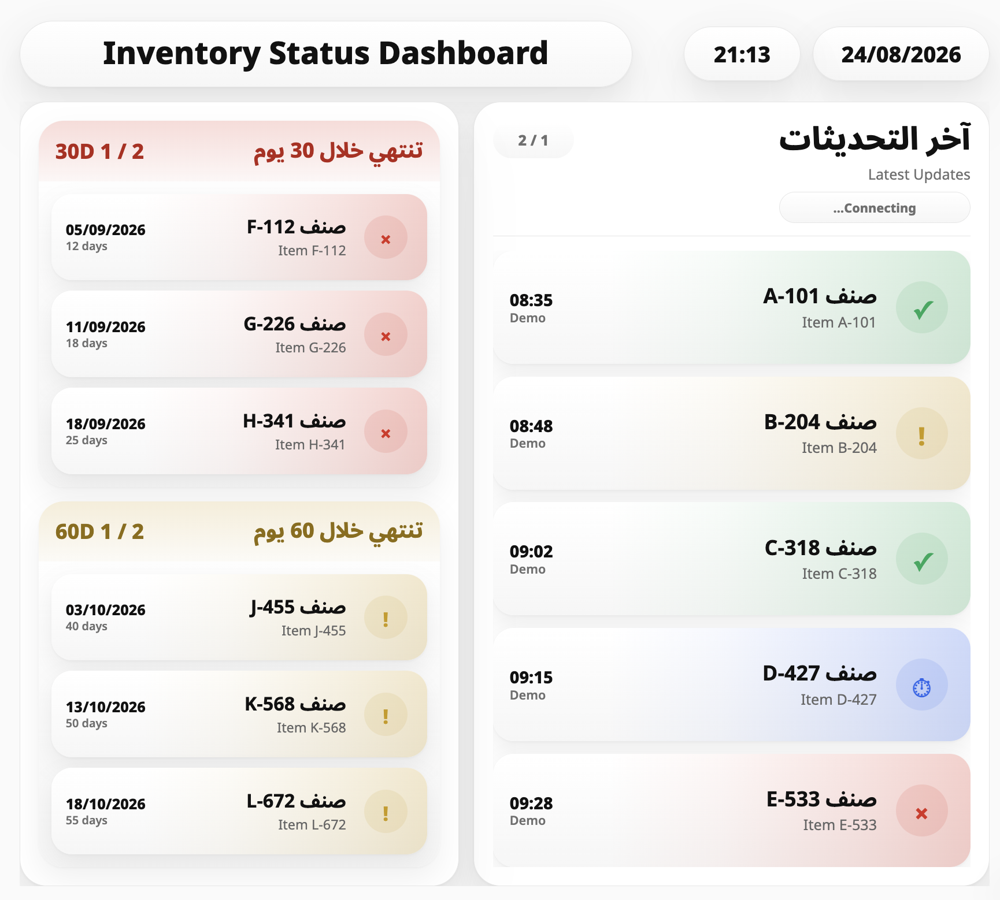

# Inventory Status Dashboard

A bilingual (Arabic / English) real-time inventory intelligence experience — built to turn stock awareness into instinct.

## Why this exists

In fast-moving, high-pressure environments, the cost of finding out too late is real: a shortage that could've been caught, an item that expired unnoticed. This project reimagines inventory awareness as something ambient and instant, always a glance away, instead of something you have to stop and go looking for.

## Features

- Real-time inventory status intelligence
- Instant visibility into availability and near-expiry risk
- Built for environments where every second of distraction has a cost
- Bilingual interface (Arabic / English) with RTL-aware layout

## Tech stack

- HTML, CSS <!-- add JavaScript / frameworks here if used -->

## Getting started

```bash
git clone https://github.com/waad-alwagdani/inventory-status-dashboard.git
cd inventory-status-dashboard
# open index.html in your browser
```

## Screenshots



## Status

Prototype / in progress — feedback welcome.

## License

© Waad Alwagdani. All rights reserved.

This project is shared publicly for portfolio and demonstration purposes only. No permission is granted to copy, modify, distribute, or reuse this code without prior written consent.
